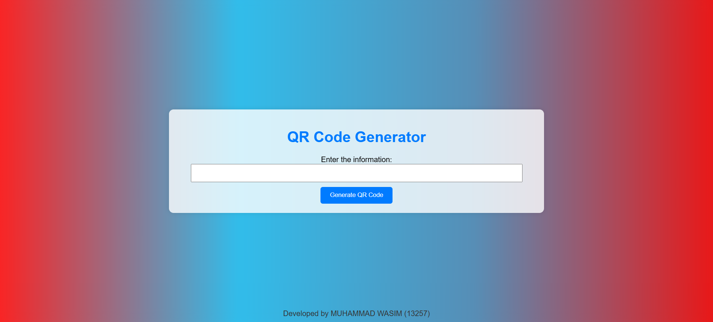

# QRCodeGenerator

A simple and efficient QR Code Generator built with Html,CSS, JavaScript. This tool allows you to quickly generate QR codes for URLs, text, contact information, and more.

## 🔧 Features

- ✅ Generate QR codes instantly
- 📦 Supports URLs, text, and more
- 🎨 Downloadable QR code image
- 🖥️ User-friendly interface
- 💡 Lightweight and easy to integrate

## 📷 Screenshot

